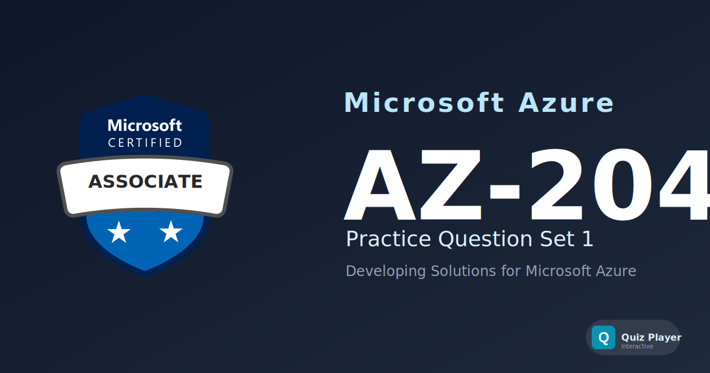

# AZ-204 Practice Section 1

Practice questions for the **Developing Solutions for Microsoft Azure (AZ-204)** certification exam. This set covers building and deploying Azure compute solutions, working with Azure storage and Cosmos DB, implementing authentication and secure access, and integrating Azure services using Event Grid, Service Bus, and API Management.

## Content Overview

- **36 Questions** — Single choice, multiple choice, and ordering
- **Topics**:
  - Develop Azure Compute Solutions (25–30%)
  - Develop for Azure Storage (15–20%)
  - Implement Azure Security (20–25%)
  - Monitor, Troubleshoot, and Optimize Azure Solutions (15–20%)
  - Connect to and Consume Azure Services (15–20%)

## What This Does Not Cover

This question set focuses on **architectural decisions and service configuration**. It does not include live coding exercises, full ARM/Bicep template authoring, or step-by-step deployment walkthroughs. It is not a substitute for official Microsoft Learn training paths.

## Disclaimer

> [!IMPORTANT]
> These questions are **AI-generated** for study and practice purposes. They are **not** exam dumps and do not contain actual questions from the Microsoft certification exam. Use them to test your understanding of Azure concepts, not as a substitute for official study materials.

## Usage

This repository is designed to be used with the [Quiz Player](https://quizplay.io). Click the badge above to launch the quiz directly.

## License

This content is licensed under the [GNU Affero General Public License v3.0](LICENSE).
